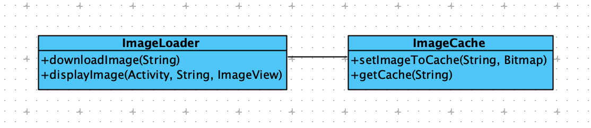
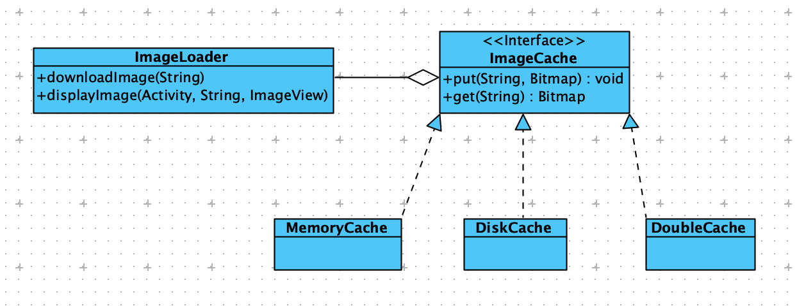
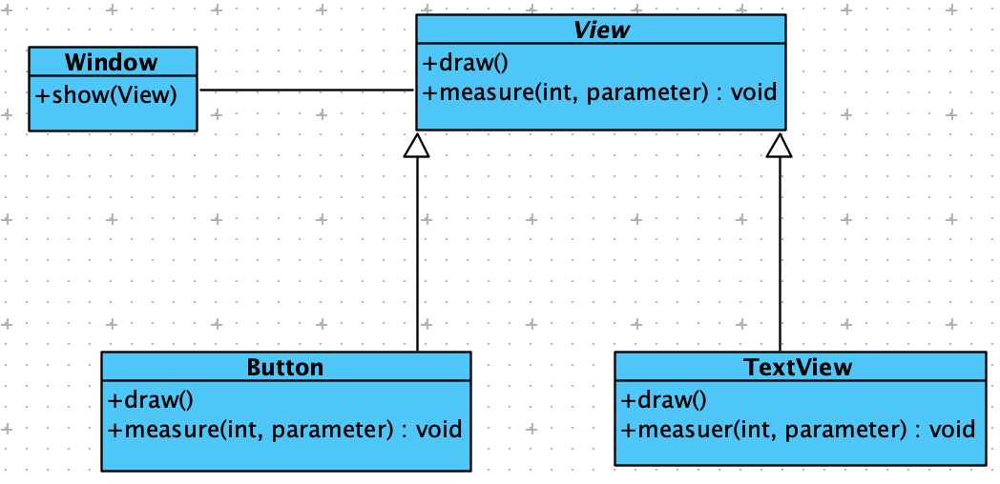
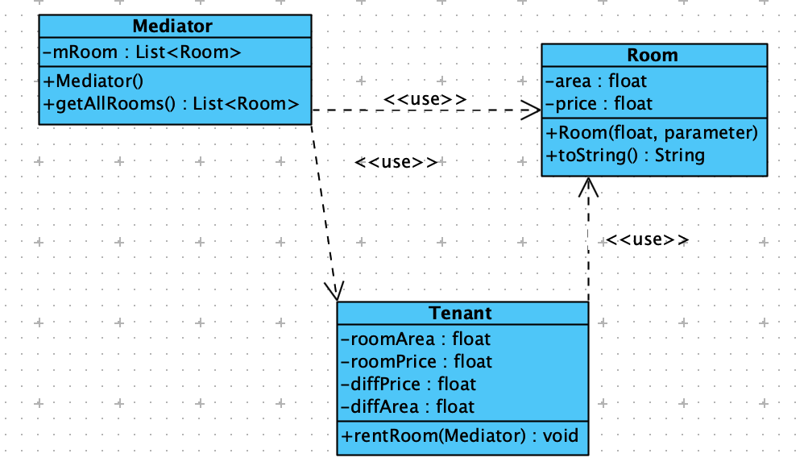
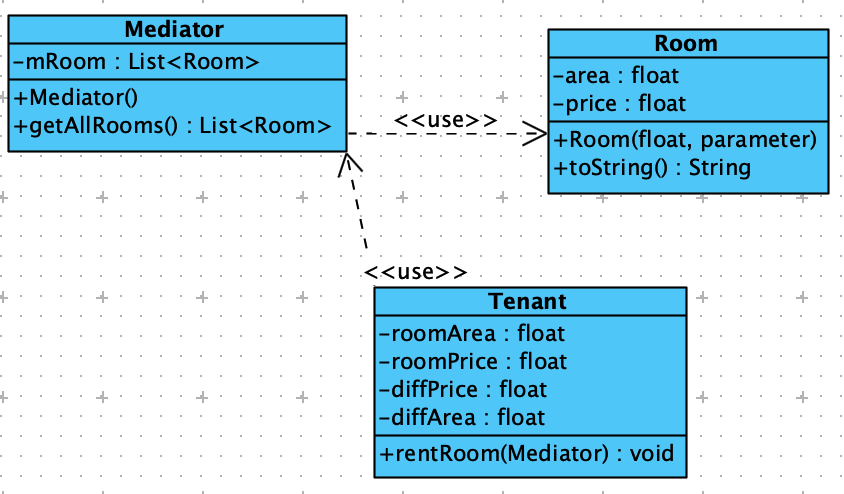

在实际开发过程中如何权衡、实践这些原则，大家需要在实践中多思考与领悟，正所谓**<u>“学而不思则罔，思而不学则殆”</u>**，只有==不断地学习、实践、思考==，才能够在积累的过程中有一个质的飞跃。

> **<u>孔子提倡的学习方法</u>**：一味读书而不思考，就会因为不能深刻理解书本的意义而==不能合理有效利用书本的知识==，甚至会**<u>陷入迷茫</u>**。而如果一味空想而不去进行实实在在的钻研和学习，则终究是沙上建塔，一无所得。告诫我们**<u>只有把学习和思考结合起来，才能学到切实有用的知识</u>**，否则就会收效甚微！

在应用开发过程中，**<u>最难的不是完成应用的开发工作</u>**，而是在后续的升级、维护过程中让应用系统能够==拥抱变化==。拥抱变化也就意味着**<u>在满足需求且不破坏系统稳定性的前提下保持高可扩展性、高内聚、低耦合</u>**，在经历了各版本的变更之后依然保持**<u>清晰、灵活、稳定的系统架构</u>**。当然，这时一个比较理想的情况，但我们必须要朝着这个方向去努力，那么遵循面向对象六大原则就是我们走向灵活软件之路所迈出的第一步。

# 1 优化代码的第一步：单一职责原则

==单一职责原则==：就一个类而言，应该仅有一个引起它变化的原因。简单来说，**<u>一个类中应该是一组相关性很高的函数、数据的封装</u>**。

**<u>单一职责的划分界限</u>**并不是总是那么的清晰，很多时候都是需要靠个人经验来界定。当然，最大的问题就是**<u>对职责的定义，什么是类的职责，以及怎么划分类的职责</u>**。

但首先我需要理解**<u>类、对象</u>**等这些 OOP 的基本概念！

> （==计算机应用技术==的==实践方法==）对于计算机技术，通常只单纯地学习理论知识并不能很好地领会其深意，只有**<u>自己动手实践</u>**，并**<u>在实际运用中发现问题、解决问题、思考问题</u>**，才能够将知识吸收到自己的脑海中。

目的：训练面向对象设计，**<u>考虑程序可扩展性、灵活性</u>**。用户不断地提出需求、反馈问题（==现实情况==），（==要求==）项目需要不断升级以满足用户需求，并且保证系统的稳定性、灵活性。（从『重构：改善既有代码的设计』可知：就是因为项目在不断变化中，才需要不断重构项目代码，才对项目代码的可扩展性、灵活性提出要求。）

下面以图片加载器 ImageLoader 作为训练项目：实现图片加载，并且将图片缓存起来。

可以得到以下基础版本：

~~~java
package com.ant.codedesignpatterns;

import android.app.Activity;
import android.graphics.Bitmap;
import android.graphics.BitmapFactory;
import android.util.Log;
import android.util.LruCache;
import android.widget.ImageView;

import java.io.IOException;
import java.net.HttpURLConnection;
import java.net.MalformedURLException;
import java.net.URL;
import java.util.concurrent.ExecutorService;
import java.util.concurrent.Executors;

public class ImageLoader {
    private static final String TAG = ImageLoader.class.getSimpleName();

    private LruCache<String, Bitmap> mImageCache;
    private final ExecutorService mExecutorService;

    public ImageLoader(){
        // 线程池中线程数量为 CPU 的个数
        mExecutorService = Executors.newFixedThreadPool(Runtime.getRuntime().availableProcessors());
        initImageCache();
    }

    private void initImageCache(){
        // TODO: 2020-07-08 计算的单位是什么？计算得到的是 KB，得到进程可用的内存数
        final int maxMemory = (int) (Runtime.getRuntime().maxMemory() / 1024);
        // 384MB 内存
        Log.d(TAG, "Processor's maxMemory:"+ maxMemory);

        // 以 maxMemory / 4 的内存量作为缓存容量
        final int cacheSize = maxMemory / 4;
        mImageCache = new LruCache<String, Bitmap>(cacheSize){
            @Override
            protected int sizeOf(String key, Bitmap bitmap) {
                int bitmapSize = bitmap.getRowBytes() * bitmap.getHeight() / 1024;
                // 1047KB接近1.022 MB
                Log.d(TAG, "bitmapSize:"+ bitmapSize);

                return bitmapSize;
            }
        };
    }

    private Bitmap downloadImage(String imageUrl){
        Bitmap bitmap = null;

        try {
            URL url = new URL(imageUrl);

            final HttpURLConnection urlConnection = (HttpURLConnection) url.openConnection();
            bitmap = BitmapFactory.decodeStream(urlConnection.getInputStream());

            urlConnection.disconnect();
        } catch (MalformedURLException e) {
            e.printStackTrace();
        } catch (IOException e) {
            e.printStackTrace();
        }

        return bitmap;
    }

    public void displayImage(final Activity activity, final String url, final ImageView imageView){
        imageView.setTag(url);

        mExecutorService.submit(new Runnable() {
            @Override
            public void run() {
                final Bitmap bitmap = downloadImage(url);
                if(bitmap == null){
                    Log.d(TAG, "bitmap is null!");
                    return;
                }

                Log.d(TAG, "bitmap: width:"+ bitmap.getWidth() + "; height:"+ bitmap.getHeight());
                if(imageView.getTag().equals(url)){
                    activity.runOnUiThread(new Runnable() {
                        @Override
                        public void run() {
                            imageView.setImageBitmap(bitmap);
                        }
                    });
                }

                mImageCache.put(url, bitmap);
            }
        });
    }
}

~~~

项目的基本过程和封装：

* 图片获取，网络请求或者是从 sdcard 获取图片（仅仅只是获取方式的差异）；
* 图片缓存，依据上一步骤获取的图片，将其存于内存中。

我们来看看**<u>上述代码的问题</u>**：

1. ImageLoader **<u>代码耦合严重</u>**，没有扩展性、灵活性可言；
2. 所有的代码——图片获取、缓存——都写在一个类中，**<u>代码越来越复杂，系统的稳定性越来越脆弱</u>**；
3. 另外上述代码存在 bug：并不能达到图片缓存的目的。获取图片是应首先从缓存搜索已存的 Bitmap 对象。

接下来是拆分 ImageLoader，把各个功能独立出来，让其满足**<u>单一职责原则</u>**：

* ImageLoader 拆分出 ImageCache 类，**<u>专门用于缓存图片实例</u>**；
* ImageLoader **<u>职责明确，仅用于图片的加载</u>**。

其中 ImageLoader 和 ImageCache 两者是依赖关系，具体是：<u>ImageLoader 持有了 ImageCache 实例</u>。

~~~java
package com.ant.codedesignpatterns;

import android.graphics.Bitmap;
import android.util.Log;
import android.util.LruCache;

public class ImageCache {

    private static final String TAG = ImageCache.class.getSimpleName();

    private LruCache<String, Bitmap> mImageCache;

    public ImageCache(){
        initImageCache();
    }

    private void initImageCache(){
        // TODO: 2020-07-08 计算的单位是什么？计算得到的是 KB
        final int maxMemory = (int) (Runtime.getRuntime().maxMemory() / 1024);
        // 384MB 内存
        Log.d(TAG, "Processor's maxMemory:"+ maxMemory);

        final int cacheSize = maxMemory / 4;
        mImageCache = new LruCache<String, Bitmap>(cacheSize){
            @Override
            protected int sizeOf(String key, Bitmap bitmap) {
                int bitmapSize = bitmap.getRowBytes() * bitmap.getHeight() / 1024;
                // 1047KB接近1.022 MB
                Log.d(TAG, "bitmapSize:"+ bitmapSize);

                return bitmapSize;
            }
        };
    }

    public void setImageToCache(String url, Bitmap bitmap){
        mImageCache.put(url, bitmap);
    }

    public Bitmap getCache(String url){
        return mImageCache.get(url);
    }
}
~~~

如果 ImageCache 的基础逻辑有改变的话，可直接在 ImageCache 中修改，而无需改动 ImageLoader 的代码。

~~~java
package com.ant.codedesignpatterns;

import android.app.Activity;
import android.graphics.Bitmap;
import android.graphics.BitmapFactory;
import android.util.Log;
import android.util.LruCache;
import android.widget.ImageView;

import java.io.IOException;
import java.net.HttpURLConnection;
import java.net.MalformedURLException;
import java.net.URL;
import java.util.concurrent.ExecutorService;
import java.util.concurrent.Executors;

public class ImageLoader {
    private static final String TAG = ImageLoader.class.getSimpleName();

    private final ExecutorService mExecutorService;
    private final ImageCache mImageCache;

    public ImageLoader(){
        mExecutorService = Executors.newFixedThreadPool(Runtime.getRuntime().availableProcessors());
        mImageCache = new ImageCache();
    }

    private Bitmap downloadImage(String imageUrl){
        Bitmap bitmap = null;

        try {
            URL url = new URL(imageUrl);

            final HttpURLConnection urlConnection = (HttpURLConnection) url.openConnection();
            bitmap = BitmapFactory.decodeStream(urlConnection.getInputStream());

            urlConnection.disconnect();
        } catch (MalformedURLException e) {
            e.printStackTrace();
        } catch (IOException e) {
            e.printStackTrace();
        }

        return bitmap;
    }

    public void displayImage(final Activity activity, final String url, final ImageView imageView){
        // 此部分相当于是解决 bug，填充之前从缓存获取 Bitmap 实例的漏洞
        Bitmap bitmap = mImageCache.getCache(url);
        if(bitmap != null){
            Log.d(TAG, "ImageCache is cached!");
            // ImageCache 已缓存，直接获取并填充 ImageView
            imageView.setImageBitmap(bitmap);
            return;
        }

        imageView.setTag(url);

        mExecutorService.submit(new Runnable() {
            @Override
            public void run() {
                final Bitmap bitmap = downloadImage(url);
                if(bitmap == null){
                    Log.d(TAG, "bitmap is null!");
                    return;
                }

                Log.d(TAG, "bitmap: width:"+ bitmap.getWidth() + "; height:"+ bitmap.getHeight());
                if(imageView.getTag().equals(url)){
                    activity.runOnUiThread(new Runnable() {
                        @Override
                        public void run() {
                            imageView.setImageBitmap(bitmap);
                        }
                    });
                }

                mImageCache.setImageToCache(url, bitmap);
            }
        });
    }
}

~~~

ImageLoader 类的代码量减少，从中抽取出了 ImageCache 类，**<u>专用</u>**于图片数据的缓存。对应的，如果图片加载的逻辑需要修改，可直接改动 ImageLoader，对 ImageCache 无影响。即：**<u>类的逻辑修改时，不会影响到其他类</u>**。

这就是单一职责的具体表现！如何划分一个类、一个函数的职责，每个人都有自己的看法，这需要根据个人经验、具体的业务逻辑而定。但是，它也有一些基本的指导原则，例如，两个完全不一样的功能就不应该放在一个类中。==一个类中应该是一组相关性很高的函数、数据的封装==。

工程师可以**<u>不断地审视自己的代码</u>**，根据具体的业务、功能对类进行相应的拆分，这时程序员优化代码迈出的第一步！

# 2 让程序更稳定、更灵活：开闭原则

开闭原则：Open Close Principle，是 Java 世界里**<u>最基础的设计原则</u>**，它指导我们**<u>如何建立一个稳定的、灵活的系统</u>**。

开闭原则的定义是：软件中的对象（类、模式、函数等）应该对于**<u>扩展是开放的</u>**，但是**<u>对于修改是封闭的</u>**。

在软件的生命周期内，因为**<u>变化、升级和维护</u>**等原因需要对软件原有代码进行修改时，可能会**<u>将错误（本次修改的内容）引入原本已经经过测试的旧代码中，破坏原有系统（通过测试的代码）</u>**。因此，当软件需要变化时，我们应该**<u>尽量通过扩展的方式来实现变化</u>**，而不是通过修改已有的代码来实现。当然，在现实开发中，只通过继承的方式来升级、、维护原有系统只是一个理想化的愿景，因此，在实际的开发过程中，修改原有代码、扩展代码往往是同时存在的。

软件开发过程中，最不会变化的就是变化本身。产品需要不断地升级、维护，没有一个产品从第一版本开发完就再没有变化了，除非在下个版本诞生之前它已经被终止。而**<u>产品需要升级</u>**，**<u>修改原来的代码就可能会引发其他的问题</u>**。如何确保原有软件模块的正确性，以及尽量少地影响原有模块？答案就是，尽量遵守『开闭原则』。

勃兰特·梅耶在 1988 年提出开闭原则时，这一想法是这样的：程序一旦开发完成，程序中一个类的实现只应该因错误而被修改，新的或者改变的特性应该通过新建不同的类实现，新建的类可以通过继承的方式来重用原类的代码，以此实现变化。

还是接着上面的 ImageLoader 继续优化代码：随着用户的增多，有些问题也暴露出来了，其中**<u>缓存系统</u>**被“吐槽”最多。通过**<u>内存缓存</u>**解决了每次从网络加载图片的问题，但是，Android 应用的内存很有限，且具有**<u>易失性</u>**，即当应用重新启动之后，原来已经加载过的图片将丢失，这样重启之后就需要重新下载！这又会导致**<u>加载缓慢、耗费用户流量</u>**的问题。因此，考虑引入 SD 卡缓存，这样下载过的图片就会缓存到本地，即使重启应用也不需要重新下载了。

~~~java
package com.ant.codedesignpatterns;

import android.graphics.Bitmap;
import android.graphics.BitmapFactory;
import android.util.Log;

import java.io.File;
import java.io.FileNotFoundException;
import java.io.FileOutputStream;
import java.io.IOException;

public class DiskCache {
    private static final String TAG = DiskCache.class.getSimpleName();
    private static final String CACHE_DIR_PATH = "sdcard/cache";

    public boolean put(String url, Bitmap bitmap) {
        FileOutputStream fileOutputStream = null;
        boolean outputResult = false;
        try {
            File cacheDir = new File(CACHE_DIR_PATH);
            if (!cacheDir.exists()) {
                cacheDir.mkdirs();
            }

            File destFile = new File(cacheDir + File.separator + url);
            if (!destFile.exists()) {
                destFile.createNewFile();
            }

            fileOutputStream = new FileOutputStream(destFile);
            // workThread
            outputResult = bitmap.compress(Bitmap.CompressFormat.PNG, 100, fileOutputStream);
            Log.d(TAG, "compress result:" + outputResult);
        } catch (FileNotFoundException e) {
            e.printStackTrace();
        } catch (IOException e) {
            e.printStackTrace();
        } finally {
            if (fileOutputStream != null) {
                try {
                    fileOutputStream.close();
                } catch (IOException e) {
                    e.printStackTrace();
                }
            }
        }

        return outputResult;
    }

    public Bitmap get(String url) {
        return BitmapFactory.decodeFile(CACHE_DIR_PATH + File.separator + url);
    }
}
~~~

新创建了 DiskCache 类，封装的是 SCARED 缓存器功能。

~~~java
package com.ant.codedesignpatterns;

import android.app.Activity;
import android.graphics.Bitmap;
import android.graphics.BitmapFactory;
import android.util.Log;
import android.widget.ImageView;

import java.io.IOException;
import java.net.HttpURLConnection;
import java.net.MalformedURLException;
import java.net.URL;
import java.util.concurrent.ExecutorService;
import java.util.concurrent.Executors;

public class ImageLoader {
    private static final String TAG = ImageLoader.class.getSimpleName();

    private final ExecutorService mExecutorService;
    private final ImageCache mImageCache;

    private final DiskCache mDiskCache;
    private boolean isUseDiskCache = false;

    public ImageLoader() {
        mExecutorService = Executors.newFixedThreadPool(Runtime.getRuntime().availableProcessors());
        mImageCache = new ImageCache();
        // 添加新的缓存器
        mDiskCache = new DiskCache();
    }

    private Bitmap downloadImage(String imageUrl) {
        Bitmap bitmap = null;

        try {
            URL url = new URL(imageUrl);

            final HttpURLConnection urlConnection = (HttpURLConnection) url.openConnection();
            bitmap = BitmapFactory.decodeStream(urlConnection.getInputStream());

            urlConnection.disconnect();
        } catch (MalformedURLException e) {
            e.printStackTrace();
        } catch (IOException e) {
            e.printStackTrace();
        }

        return bitmap;
    }

    public void displayImage(final Activity activity, final String url, final ImageView imageView) {
        // 此处需对待存储文件名做特殊处理，使用 url 会导致 File 读写异常
        Bitmap bitmap = isUseDiskCache ? mDiskCache.get("1.png") : mImageCache.getCache(url);
        if (bitmap != null) {
            Log.d(TAG, "ImageCache is cached!");
            // ImageCache 已缓存，直接获取并填充 ImageView
            imageView.setImageBitmap(bitmap);
            return;
        }

        imageView.setTag(url);

        mExecutorService.submit(new Runnable() {
            @Override
            public void run() {
                final Bitmap bitmap = downloadImage(url);
                if (bitmap == null) {
                    Log.d(TAG, "bitmap is null!");
                    return;
                }

                Log.d(TAG, "bitmap: width:" + bitmap.getWidth() + "; height:" + bitmap.getHeight());
                if (imageView.getTag().equals(url)) {
                    activity.runOnUiThread(new Runnable() {
                        @Override
                        public void run() {
                            imageView.setImageBitmap(bitmap);
                        }
                    });
                }

                if (isUseDiskCache) {
                    // 此处需对待存储文件名做特殊处理，使用 url 会导致 File 读写异常
                    // workThread
                    mDiskCache.put("1.png", bitmap);
                } else {
                    mImageCache.setImageToCache(url, bitmap);
                }
            }
        });
    }

    public void useDiskCache(boolean useDiskCache) {
        this.isUseDiskCache = useDiskCache;
    }
}
~~~

确实，新创建了 DiskCache 类，并往 ImageLoader 中添加了少许代码，就实现了新增加的功能。

但有些很明显的问题：就是使用内存缓存时用户就不能使用 SD 卡缓存。类似的，使用了 SD 卡缓存时用户就不能使用内存缓存。用户需要这两种策略的综合：首先缓存优先使用内存缓存，如果内存缓存没有图片再使用 SD 卡缓存，如果 SD 卡中也没有图片最后才从网络上获取，这才是最好的缓存策略。这也就是所谓的『**<u>双缓存策略</u>**』。

~~~java
package com.ant.codedesignpatterns;

import android.graphics.Bitmap;
import android.util.Log;

public class DoubleCache {
    private static final String TAG = DoubleCache.class.getSimpleName();

    ImageCache mMemoryCache = new ImageCache();
    DiskCache mDiskCache = new DiskCache();

    public Bitmap get(String url) {
        Bitmap bitmap = mMemoryCache.getCache(url);
        if (bitmap == null) {
            bitmap = mDiskCache.get(url);

            if (bitmap != null) {
                Log.d(TAG, "已从 sd 卡缓存中获取到 Bitmap");
            }
        } else {
            Log.d(TAG, "已从内存缓存中获取到 Bitmap");
        }

        return bitmap;
    }

    public void put(String url, Bitmap bitmap) {
        // 双缓存图片也就是内存和 sdcard 中都缓存一份
        mMemoryCache.setImageToCache(url, bitmap);
        mDiskCache.put(url, bitmap);
    }
}
~~~

DoubleCache 中包含有 ImageCache 和 DiskCache 实例，体现双缓存的特征。

这样使用 DoubleCache：

~~~java
package com.ant.codedesignpatterns;

import android.app.Activity;
import android.graphics.Bitmap;
import android.graphics.BitmapFactory;
import android.util.Log;
import android.widget.ImageView;

import java.io.IOException;
import java.net.HttpURLConnection;
import java.net.MalformedURLException;
import java.net.URL;
import java.util.concurrent.ExecutorService;
import java.util.concurrent.Executors;

public class ImageLoader {
    private static final String TAG = ImageLoader.class.getSimpleName();

    private final ExecutorService mExecutorService;
    private final ImageCache mImageCache;
    private final DiskCache mDiskCache;
    private boolean isUseDiskCache = false;

    private final DoubleCache mDoubleCache;
    private boolean isUseDoubleCache = false;

    public ImageLoader() {
        mExecutorService = Executors.newFixedThreadPool(Runtime.getRuntime().availableProcessors());
        mImageCache = new ImageCache();
        mDiskCache = new DiskCache();

        mDoubleCache = new DoubleCache();
    }

    private Bitmap downloadImage(String imageUrl) {
        Bitmap bitmap = null;

        try {
            URL url = new URL(imageUrl);

            final HttpURLConnection urlConnection = (HttpURLConnection) url.openConnection();
            bitmap = BitmapFactory.decodeStream(urlConnection.getInputStream());

            urlConnection.disconnect();
        } catch (MalformedURLException e) {
            e.printStackTrace();
        } catch (IOException e) {
            e.printStackTrace();
        }

        return bitmap;
    }

    public void displayImage(final Activity activity, final String url, final ImageView imageView) {
        Bitmap bitmap = null;
        if (isUseDoubleCache) {
            bitmap = mDoubleCache.get("1.png");
        } else if (isUseDiskCache) {
            bitmap = mDiskCache.get("1.png");
        } else {
            bitmap = mImageCache.getCache(url);
        }

        if (bitmap != null) {
            // 已从缓存中找到 Bitmap 对象
            imageView.setImageBitmap(bitmap);
            return;
        }

        imageView.setTag(url);

        mExecutorService.submit(new Runnable() {
            @Override
            public void run() {
                final Bitmap bitmap = downloadImage(url);
                if (bitmap == null) {
                    Log.d(TAG, "bitmap is null!");
                    return;
                }

                Log.d(TAG, "bitmap: width:" + bitmap.getWidth() + "; height:" + bitmap.getHeight());
                if (imageView.getTag().equals(url)) {
                    activity.runOnUiThread(new Runnable() {
                        @Override
                        public void run() {
                            imageView.setImageBitmap(bitmap);
                        }
                    });
                }

                if (isUseDoubleCache) {
                    mDoubleCache.put("1.png", bitmap);
                } else if (isUseDiskCache) {
                    mDiskCache.put("1.png", bitmap);
                } else {
                    mImageCache.setImageToCache(url, bitmap);
                }
            }
        });
    }

    public void useDiskCache(boolean useDiskCache) {
        this.isUseDiskCache = useDiskCache;
    }

    public void useDoubleCache(boolean useDoubleCache){
        this.isUseDoubleCache = useDoubleCache;
    }
}
~~~

这样设计的 DoubleCache 在使用时都会修改原来的代码，当然，如果想要设计新的缓存策略，同样会**<u>修改原来的很多代码</u>**。这样很可能会**<u>引入 bug</u>**，而且会**<u>使原来的代码逻辑变得越来越复杂</u>**。另外，用户也不能自定义缓存实现（代码的灵活性也不够高）！

我们再来完整地、仔细地分析现有的代码：每次在程序中加入新的缓存实现时都需要修改 ImageLoader 类，然后通过一个布尔变量来让用户选择使用哪种缓存策略，因此，这就使得在 ImageLoader 中存在各种 if-else 判断语句，通过判断来确定使用哪种缓存。随着这些逻辑的引入，代码变得越来越复杂、脆弱，如果不小心写错，就要花大量的时间拍错，整个 ImageLoader 类也会越来越臃肿。最重要的是，用户不能自己实现缓存注入到 ImageLoader 中，可扩展性差。**<u>可扩展性是框架的最重要特性之一</u>**。

软件中的对象（类、模块、函数等）应该对于扩展是开放的，但是对于修改是封闭的，这就是『开闭原则』。也就是说，当软件需要变化时，我们应该尽量通过扩展的方式来实现变化，而不是通过修改已有的代码来实现。

~~~java
package com.ant.codedesignpatterns;

import android.app.Activity;
import android.graphics.Bitmap;
import android.graphics.BitmapFactory;
import android.media.Image;
import android.util.Log;
import android.widget.ImageView;

import java.io.IOException;
import java.net.HttpURLConnection;
import java.net.MalformedURLException;
import java.net.URL;
import java.util.concurrent.ExecutorService;
import java.util.concurrent.Executors;

public class ImageLoader {
    private static final String TAG = ImageLoader.class.getSimpleName();

    private final ExecutorService mExecutorService;

    private ImageCache mImageCache;

    public ImageLoader() {
        mExecutorService = Executors.newFixedThreadPool(Runtime.getRuntime().availableProcessors());
        // 默认使用的是内存缓存器 MemeoryCache
        mImageCache = new MemoryCache();
    }

    public void setImageCache(ImageCache imageCache) {
        this.mImageCache = imageCache;
    }

    public void displayImage(final Activity activity, final String url, final ImageView imageView) {
        Bitmap bitmap = mImageCache.get(url);

        if (bitmap != null) {
            // 已从缓存中找到 Bitmap 对象
            imageView.setImageBitmap(bitmap);
            return;
        }
        submitLoadRequest(activity, url, imageView);
    }

    private void submitLoadRequest(final Activity activity, final String url, final ImageView imageView) {
        imageView.setTag(url);

        mExecutorService.submit(new Runnable() {
            @Override
            public void run() {
                final Bitmap bitmap = downloadImage(url);
                if (bitmap == null) {
                    Log.d(TAG, "bitmap is null!");
                    return;
                }

                Log.d(TAG, "bitmap: width:" + bitmap.getWidth() + "; height:" + bitmap.getHeight());
                if (imageView.getTag().equals(url)) {
                    activity.runOnUiThread(new Runnable() {
                        @Override
                        public void run() {
                            imageView.setImageBitmap(bitmap);
                        }
                    });
                }

                mImageCache.put(url, bitmap);
            }
        });
    }

    private Bitmap downloadImage(String imageUrl) {
        Bitmap bitmap = null;

        try {
            URL url = new URL(imageUrl);

            final HttpURLConnection urlConnection = (HttpURLConnection) url.openConnection();
            bitmap = BitmapFactory.decodeStream(urlConnection.getInputStream());

            urlConnection.disconnect();
        } catch (MalformedURLException e) {
            e.printStackTrace();
        } catch (IOException e) {
            e.printStackTrace();
        }

        return bitmap;
    }
}
~~~

经过上面的重构，没有了 if-else 语句，没有了各种各样的缓存实现对象、布尔变量，代码确实清晰、简单了很多。

~~~java
package com.ant.codedesignpatterns;

import android.graphics.Bitmap;

public interface ImageCache {
    void put(String url, Bitmap bitmap);

    Bitmap get(String url);
}
~~~

ImageLoader 是抽取出来的图片缓存借口，用来抽象图片缓存功能。内存缓存器、SD卡缓存器和双缓存器都实现了该接口。

~~~java
package com.ant.codedesignpatterns;

import android.graphics.Bitmap;
import android.util.Log;

public class DoubleCache implements ImageCache{
    private static final String TAG = DoubleCache.class.getSimpleName();

    MemoryCache mMemoryCache = new MemoryCache();
    DiskCache mDiskCache = new DiskCache();

    @Override
    public Bitmap get(String url) {
        Bitmap bitmap = mMemoryCache.get(url);
        if (bitmap == null) {
            bitmap = mDiskCache.get(url);

            if (bitmap != null) {
                Log.d(TAG, "已从 sd 卡缓存中获取到 Bitmap");
            }
        } else {
            Log.d(TAG, "已从内存缓存中获取到 Bitmap");
        }

        return bitmap;
    }

    @Override
    public void put(String url, Bitmap bitmap) {
        // 双缓存图片也就是内存和 sdcard 中都缓存一份
        mMemoryCache.put(url, bitmap);
        mDiskCache.put(url, bitmap);
    }
}
~~~

以及：

~~~java
package com.ant.codedesignpatterns;

import android.graphics.Bitmap;
import android.util.Log;
import android.util.LruCache;

public class MemoryCache implements ImageCache {

    private static final String TAG = MemoryCache.class.getSimpleName();

    private LruCache<String, Bitmap> mImageCache;

    public MemoryCache() {
        initImageCache();
    }

    private void initImageCache() {
        // TODO: 2020-07-08 计算的单位是什么？计算得到的是 KB
        final int maxMemory = (int) (Runtime.getRuntime().maxMemory() / 1024);
        // 393216KB --> 384MB 内存
        Log.d(TAG, "Processor's maxMemory:" + maxMemory);

        // 384MB --> 96MB 可用于缓存
        final int cacheSize = maxMemory / 4;
        mImageCache = new LruCache<String, Bitmap>(cacheSize) {
            @Override
            protected int sizeOf(String key, Bitmap bitmap) {
                int bitmapSize = bitmap.getRowBytes() * bitmap.getHeight() / 1024;
                // 1047KB 接近 1.022 MB
                Log.d(TAG, "bitmapSize:" + bitmapSize);

                return bitmapSize;
            }
        };
    }

    @Override
    public void put(String url, Bitmap bitmap) {
        mImageCache.put(url, bitmap);
    }

    @Override
    public Bitmap get(String url) {
        return mImageCache.get(url);
    }
}
~~~

以及：

~~~java
package com.ant.codedesignpatterns;

import android.graphics.Bitmap;
import android.graphics.BitmapFactory;
import android.util.Log;

import java.io.File;
import java.io.FileNotFoundException;
import java.io.FileOutputStream;
import java.io.IOException;

public class DiskCache implements ImageCache {
    private static final String TAG = DiskCache.class.getSimpleName();
    private static final String CACHE_DIR_PATH = "sdcard/cache";

    @Override
    public void put(String url, Bitmap bitmap) {
        FileOutputStream fileOutputStream = null;
        boolean outputResult = false;
        try {
            File cacheDir = new File(CACHE_DIR_PATH);
            if (!cacheDir.exists()) {
                cacheDir.mkdirs();
            }

            File destFile = new File(cacheDir + File.separator + url);
            if (!destFile.exists()) {
                destFile.createNewFile();
            }

            fileOutputStream = new FileOutputStream(destFile);
            // workThread
            outputResult = bitmap.compress(Bitmap.CompressFormat.PNG, 100, fileOutputStream);
            Log.d(TAG, "compress result:" + outputResult);
        } catch (FileNotFoundException e) {
            e.printStackTrace();
        } catch (IOException e) {
            e.printStackTrace();
        } finally {
            if (fileOutputStream != null) {
                try {
                    fileOutputStream.close();
                } catch (IOException e) {
                    e.printStackTrace();
                }
            }
        }
    }

    @Override
    public Bitmap get(String url) {
        return BitmapFactory.decodeFile(CACHE_DIR_PATH + File.separator + url);
    }
}
~~~

ImageLoader 类中增加了一个 setImageLoader(ImageCache imageCache) 函数，用户可以通过该函数设置缓存实现，也就是通常说的**<u>依赖注入</u>**。这样不仅能够使 ImageLoader **<u>更简单、健壮</u>**，也使得 ImageLoader 的**<u>可扩展性、灵活性更高</u>**。

其中所述的 MemoryCache、DiskCache 和 DoubleCache 缓存图片的具体实现完全不一样，但是，它们的一个特点是，都实现了 ImageCache 接口。当用户需要自定义实现缓存策略时，只需要新建一个实现 ImageLoader 接口的类，然后构造该类的对象，并通过 setImageCache(ImageCache cache) 注入到 ImageLoader 中，这样 ImageLoader 就实现了千变万化的缓存策略，且扩展这些缓存策略并不会导致 ImageLoader 类的修改。—— 这种设计思路实际就是符合：“软件中的对象（类、模块、函数等）应该对于扩展时开放的，但是，对于修改是封闭的。而遵循开闭原则的重要手段应该是通过抽象......”

『==开闭原则指导我们：当软件需要发生变化时，应该尽量通过扩展的方式来实现变化，而不是通过修改已有的代码来实现==。』

当我们嗅到原来的**<u>代码“腐化气味”</u>**时，应该尽早地**<u>重构</u>**，以便使代码恢复到正常的“进化”过程，而不是**<u>直接地</u>**通过继承等方式添加新的实现，这会导致类型的膨胀以及历史遗留代码的冗余。我们的开发过程中也没有那么理想化的状况，完全地不用修改原来的代码，因此，在开发过程中需要自己结合具体情况进行考量，是通过修改旧代码还是通过继承使得软件系统更稳定、更灵活，在保证去除“代码腐化”的同时，也保证原有模块的正确性。

# 3 构建扩展性更好的系统——里氏替换原则

里氏替换原则：所有引用基类的地方必须能**<u>透明地</u>**使用其子类的对象。

面向对象的语言的三大特点是继承、封装和多态，里氏替换原则就是依赖于继承、多态这两大特性。

里氏替换原则，通俗点说：**<u>只要父类能出现的地方子类就可以出现，而且替换为子类也不会产生任何错误或异常，使用者可能根本就不需要知道是父类还是子类</u>**。但是，反过来就不行了，有子类出现的地方，父类未必就能适应。说了这么多，其实最终总结就两个字：==抽象==。

上述结构的基本实现：

~~~java
public class Window{
	public void show(View view){
        view.draw();
    }
}

public abstract View{
    public abstract void draw();
    public void measure(int width, int height){
        // 测量视图大小
    }
}

public class Button extends View{
    public void draw(){
        // 绘制按钮
    }
}

public class TextView extends View{
    public void draw(){
        // 绘制文本
    }
}
~~~

上述结构中，Window 依赖于 View，而 View 定义了一个视图抽象，measure 是各个子类共享的方法，子类通过覆写 View 的 draw 方法实现具有各自特色的功能，在这里，这个方法就是绘制自身的内容。**<u>任何继承自 View 类的子类都可以设置给 show()，就是所说的里氏替换</u>**。通过里氏替换，就**<u>可以自定义各式各样、千变万化的 View</u>**，然后传递给 Window，Window 负责组织 View，并且将 View 显示到屏幕上。

里氏替换原则的核心原理就是==抽象==，**<u>抽象又依赖于继承这个特性</u>**，在 OOP 当中，继承的优缺点都相当明显。==优点==有以下几点：

1. 代码复用，减少创建类的成本，每个子类都拥有父类的方法和属性；
2. 子类与父类基本相似，但又与父类有所区别；
3. 提高代码的可扩展性。

继承的==缺点==：

1. 继承是侵入性的，只要继承就必须拥有父类的所有属性和方法；
2. 可能造成子类代码冗余、灵活性降低，因为子类必须拥有父类的属性和方法。

==事物总是具有两面性，如何权衡利与弊都是需要根据具体情况来作出选择并加以处理==。里氏替换原则指导我们**<u>构建扩展性更好的软件系统</u>**。

再比如：

MemoryCache、DiskCache、DoubleCache 都可以替换 ImageCache 的工作，并且能够保证行为的正确性。用户只需要在使用时指定具体的缓存对象就可以动态地替换 ImageLoader 中的缓存策略。这就使得 ImageLoader 的缓存系统具有了无限的可能性，也就是保证了可扩展性。

在 ImageLoader 的 setImageCache(ImageCache cache) 中，如果 cache 对象不能够被子类所替换，那么用户如何设置不同的缓存对象，以及用户如何自定义自己的缓存实现？只能去修改 ImageLoader 的源代码了。里氏替换原则就是为了这类问题提供了**<u>指导原则</u>**，也就是**<u>建立抽象</u>**，==通过抽象建立规范==，具体的实现在运行时替换抽象，保证系统的扩展性、灵活性。

开闭原则和里氏替换原则往往是生死相依、不离不弃的，通过里氏替换来达到对扩展开放，对修改关闭的效果。然而，这两个原则都同时强调了一个 OOP 的重要特性——==抽象==，因此，<u>**在开发过程中运用抽象是走向代码优化的重要一步**</u>。

# 4 让项目拥有变化的能力——依赖倒置原则

依赖倒置原则指代了一种特定的==解耦==形式，使得**<u>高层次的模块</u>**不依赖于**<u>低层次的模块</u>**的实现细节的目的，依赖模块被颠倒了。

依赖倒置原则有以下几个关键点：

1. **<u>高层模块</u>**不应该依赖**<u>低层模块</u>**，两者都应该**<u>依赖其抽象</u>**；

   高层模块就是**<u>调用端</u>**，低层模块就是**<u>具体实现类</u>**。

2. **<u>抽象</u>**不应该依赖**<u>细节</u>**；细节应该**<u>依赖</u>**抽象。

   在 Java 语言中，**<u>抽象就是指接口或抽象类</u>**，两者都是不能直接被实例化的；**<u>细节就是实现类</u>**，实现接口或继承抽象类而产生的类就是细节，其特点就是：可以直接被实例化，也就是可以加上一个关键字 new 产生一个对象。

依赖倒置原则在 Java 语言中的表现就是：**<u>模块间的依赖通过抽象发生，实现类之间不发生直接的依赖关系，其依赖关系是通过接口或抽象类产生的</u>**。用一句话概括就是：==面向接口编程==，或者说是==面向抽象编程==，这里的抽象指的是接口或者抽象类。

==面向接口编程是面向对象精髓之一，也就是之前强调的抽象==。

如果类与类直接依赖于细节，那么它们之间就有直接的**<u>耦合</u>**，当具体实现需要变化时，意味着要同时修改**<u>依赖者</u>**的代码，这限制了系统的可扩展性。

下面来看看 ImageLoader 反例：

~~~java
public class ImageLoader {
    private static final String TAG = ImageLoader.class.getSimpleName();

    // 内存缓存，直接依赖于细节
    private MemoryCache mImageCache = new MemoryCache();
    
    private final ExecutorService mExecutorService;

    public ImageLoader(){
        // 线程池中线程数量为 CPU 的个数
        mExecutorService = Executors.newFixedThreadPool(Runtime.getRuntime().availableProcessors());
        initImageCache();
    }
    ...
}
~~~

ImageLoader 直接依赖于 MemoryCache，这个 MemoryCache 是**<u>一个具体实现，而不是一个抽象类或接口</u>**。这导致了 ImageLoader 直接依赖于具体细节，当 MemoryCache 不能满足 ImageLoader 而需要被其他缓存实现替换时，此时就**<u>必须修改 ImageLoader 的代码（这就是上面说的：修改依赖者的代码）</u>**。

比如：**<u>随着产品的升级，用户需要</u>**同时支持缓存到内存和 SD 卡，或者可以让用户自定义缓存实现。此时 MemoryCache 这个类名不仅不能够表达内存缓存和 SD 卡缓存的意义，也不能够满足功能。此外，用户需要自定义缓存实现时还必须继承自 MemoryCache，而用户的缓存实现可不一定与内存缓存有关，这在命名上的限制也让用户体验不好。

==依赖倒置原则，用于让系统更灵活，拥抱变化......依赖抽象，而不依赖具体实现==。

~~~java
public class ImageLoader {
    private static final String TAG = ImageLoader.class.getSimpleName();

    private final ExecutorService mExecutorService;
    
    // 图片缓存类，依赖于抽象，并且有一个默认的实现
    private ImageCache mImageCache;

    public ImageLoader() {
        mExecutorService = Executors.newFixedThreadPool(Runtime.getRuntime().availableProcessors());
        // 默认使用的是内存缓存器 MemeoryCache
        mImageCache = new MemoryCache();
    }

    public void setImageCache(ImageCache imageCache) {
        this.mImageCache = imageCache;
    }
    ...
}
~~~

要想让系统更为灵活，==抽象==似乎成了我们唯一的手段。

# 5 系统有更高的灵活性——接口隔离原则

接口隔离原则：客户端不应该依赖它不需要的接口。另一种定义是：**<u>类间的依赖关系应该建立在最小的接口上</u>**。

接口隔离原则将非常庞大、臃肿的接口拆分成==更小的和更具体的接口==，这样客户将会只需要知道他们感兴趣的方法。

接口隔离原则的目的是**<u>系统解开耦合，从而容易重构、更改和重新部署</u>**。

比如：DiskCache 中关于 FileOutputStream 的使用，try...catch...撰写地非常繁琐，特别容易出现错误。

~~~java
package com.ant.codedesignpatterns;

import android.graphics.Bitmap;
import android.graphics.BitmapFactory;
import android.util.Log;

import java.io.File;
import java.io.FileNotFoundException;
import java.io.FileOutputStream;
import java.io.IOException;

public class DiskCache {
    private static final String TAG = DiskCache.class.getSimpleName();
    private static final String CACHE_DIR_PATH = "sdcard/cache";

    public boolean put(String url, Bitmap bitmap) {
        FileOutputStream fileOutputStream = null;
        boolean outputResult = false;
        try {
            File cacheDir = new File(CACHE_DIR_PATH);
            if (!cacheDir.exists()) {
                cacheDir.mkdirs();
            }

            File destFile = new File(cacheDir + File.separator + url);
            if (!destFile.exists()) {
                destFile.createNewFile();
            }

            fileOutputStream = new FileOutputStream(destFile);
            // workThread
            outputResult = bitmap.compress(Bitmap.CompressFormat.PNG, 100, fileOutputStream);
            Log.d(TAG, "compress result:" + outputResult);
        } catch (FileNotFoundException e) {
            e.printStackTrace();
        } catch (IOException e) {
            e.printStackTrace();
        } finally {
            if (fileOutputStream != null) {
                try {
                    fileOutputStream.close();
                } catch (IOException e) {
                    e.printStackTrace();
                }
            }
        }

        return outputResult;
    }

    public Bitmap get(String url) {
        return BitmapFactory.decodeFile(CACHE_DIR_PATH + File.separator + url);
    }
}
~~~

可以这样封装工具类：

~~~java
public final class CloseUtils{
    private CloseUtils(){}
    
    public static void closeQuietly(Closeable closeable){
        if(null != closeable){
            try{
                closeable.close();
            }catch(IOException e){
                e.printStackTrace();
            }
        }
    }
}
~~~

那这样 put(String url, Bitmap bitmap) 就可以做适当地调整：

~~~java
package com.ant.codedesignpatterns;

import android.graphics.Bitmap;
import android.graphics.BitmapFactory;
import android.util.Log;

import java.io.File;
import java.io.FileNotFoundException;
import java.io.FileOutputStream;
import java.io.IOException;

public class DiskCache {
    private static final String TAG = DiskCache.class.getSimpleName();
    private static final String CACHE_DIR_PATH = "sdcard/cache";

    public boolean put(String url, Bitmap bitmap) {
        FileOutputStream fileOutputStream = null;
        boolean outputResult = false;
        try {
            File cacheDir = new File(CACHE_DIR_PATH);
            if (!cacheDir.exists()) {
                cacheDir.mkdirs();
            }

            File destFile = new File(cacheDir + File.separator + url);
            if (!destFile.exists()) {
                destFile.createNewFile();
            }

            fileOutputStream = new FileOutputStream(destFile);
            // workThread
            outputResult = bitmap.compress(Bitmap.CompressFormat.PNG, 100, fileOutputStream);
            Log.d(TAG, "compress result:" + outputResult);
        } catch (FileNotFoundException e) {
            e.printStackTrace();
        } catch (IOException e) {
            e.printStackTrace();
        } finally {
            // 封装后的效果
            CloseUtils.closeQuietly(fileOutputStream);
        }

        return outputResult;
    }
	...
}
~~~

代码简洁了很多！而且这个 closeQuietly 方法可以运用到个类可关闭的对象中，保证了代码的重用性！
CloseUtils 的 closeQuietly 方法的基本原理就是依赖于 Closeable 抽象而不是具体实现（依赖倒置原则），并且建立在最小化依赖原则的基础上，它**<u>只需要知道这个对象是可关闭的，其他的一概不关心</u>**。这也就是此处说明的==接口隔离原则==。

此前设计的 ImageLoader 中 ImageCache 就是接口隔离原则的运用：ImageLoader 只需要知道该缓存对象有存、取缓存图片的接口即可，其他的一概不管，这就使得缓存功能的具体实现对 ImageLoader 隐藏。这就是用**<u>最小化接口隔离了实现类的细节</u>**，也促使我们**<u>将庞大的接口拆分到更细粒度的接口</u>**当中，这使得我们的系统具有==更低的耦合性，更高的灵活性==。

单一职责、开闭原则、里氏替换、接口隔离以及依赖倒置 5 个原则定义为 SOLID 原则，作为面向对象编程的 5 个基本原则。当这些原则被一起应用时，它们使得**<u>一个软件系统更清晰、简单，最大程度地拥抱变化</u>**。这些原则最终就可以化为这几个关键词：==抽象、单一职责、最小化==。

# 6 更好的扩展性——迪米特原则

迪米特原则，也被称为是：最少知识原则，描述的是：**<u>一个对象应该对其他对象有最少的了解</u>**。

通俗地讲，一个类应该对自己需要==耦合==或调用的类知道地最少，类的内部如何实现与调用者或者依赖者没关系，调用者或者依赖着只需要知道它需要的方法即可，其他的可一概不用管。**<u>类与类之间的关系越密切，耦合度越大，当一个类发生改变时，对另一个类的影响也越大</u>**。

迪米特原则，还有另外一个解释：==只与直接的朋友通信==。什么叫做直接的朋友？每个对象都必然会与其他对象有耦合关系，**<u>两个对象之间的耦合就成为朋友关系</u>**，这种关系的类型有很多，如==组合、聚合、依赖==等。

例如：租房子的场景，绝大多数是通过中介找房。我们设定的场景为：我只要求房间的面积和租金，其他的一概不管，中介将符合我要求的房子提供给我就可以了。

~~~java
public class Room{
    private float area;
    private float price;
    
    public Room(float area, float price){
        this.area = area;
        this.price = price;
    }
    
    @Override
    public String toString(){
        return "Room [area="+ area + ", price="+ price + "]";
    }
}

public class Mediator{
    List<Room> mRooms = new ArrayList<>(5);
    
    public Mediator(){
        for(int i=0; i < 5; i++){
            mRooms.add(new Room(14 + i, (14 + i) * 150));
        }
    }
    
    public List<Room>  getAllRooms(){
        return this.mRooms;
    }
}

public class Tenant{
    private float roomArea;
    private float roomPrice;
    
    public static final float diffPrice = 100.0001f;
    public static final float diffArea = 0.00001f;
    
    public void rentRoom(Mediator mediator){
        List<Room> rooms = mediator.getAllRoms;
        for(Room room : rooms){
            if(isSuitable(room)){
                System.out.println("获取到何时的房子");
                break;
            }
        }
    }
    
    private boolean isSuitable(Room room){
        return Math.abs(room.getPrice() - roomPrice) < diffPrice 
            && Math.abs(room.getArea()- roomArea) < diffArea;
    }
}
~~~

从上面代码可以看出，Tenant 类不仅**<u>依赖</u>**了 Mediator 类，还需要频繁地和 Room 类打交道（也是**<u>依赖的一种形式</u>**）。

租户类的要求只是通过中介找到一间适合自己的房子罢了，如果把这些检测条件都放在 Tenant 类中，那么中介类的功能就被弱化，而且导致 Tenant 与 Room 的耦合较高。因为 Tenant 必须知道许多关于 Room 的细节。当 Room 变化时 Tenant 也必须跟着变化。Tenant 又与 Mediator 耦合，这就出现了纠缠不清的关系。这个时候就==需要我们分清谁才是我们真正的“朋友”==。

在我们所设定的情况下，显然是 Mediator！

既然耦合太严重了，那我们就只能解耦了。首先要明确的是，我们只和我们的朋友通信，这里就是指 Mediator 对象。必须将 Room 系清关的操作从 Tenant 中移除，而这些操作应该属于 Mediator：

~~~java
public class Room{
    private float area;
    private float price;
    
    public Room(float area, float price){
        this.area = area;
        this.price = price;
    }
    
    @Override
    public String toString(){
        return "Room [area="+ area + ", price="+ price + "]";
    }
}

public class Mediator{
    List<Room> mRooms = new ArrayList<>(5);
    
    public Mediator(){
        for(int i=0; i < 5; i++){
            mRooms.add(new Room(14 + i, (14 + i) * 150));
        }
    }
    
    public List<Room>  getAllRooms(){
        return this.mRooms;
    }
    
    public Room rentOut(float area, float price){
        for(Room room : rooms){
            if(isSuitable(room)){
                System.out.println("获取到何时的房子");
                break;
            }
        }
    }
    
    private boolean isSuitable(Room room){
        return Math.abs(room.getPrice() - roomPrice) < diffPrice 
            && Math.abs(room.getArea()- roomArea) < diffArea;
    }
}

public class Tenant{
    private float roomArea;
    private float roomPrice;
    
    public static final float diffPrice = 100.0001f;
    public static final float diffArea = 0.00001f;
    
    // Tenant 只需要和 Mediator 打交道，而无需知道 Room 的存在
    public void rentRoom(Mediator mediator){
        System.out.println("租到房子了 "+ mediator.rentOut(roomArea, roomPrice));
    }   
}
~~~

只是将对于 Room 的判定操作移到了 Mediator 类中国，这本应该是 Mediator 的职责，根据租户设定的条件查找符合要求的房子，并且将结果交给租户就可以了。租户并不需要知道太多关于 Room 的细节，比如与房东签合同，房东的房产证是不是真的，房内的设施坏了之后要找谁维修等。

当我们通过我们的“朋友”——中介租了房之后，所有的事情我们都通过与中介沟通就好了，房东、维修师傅等这些角色并不是我们直接的“朋友”。**<u>“只与直接的朋友通信”</u>**这简单的几个字就能够将我们**<u>从复杂的关系网中抽离出来</u>**，使==程序耦合度更低、稳定性更好==。

