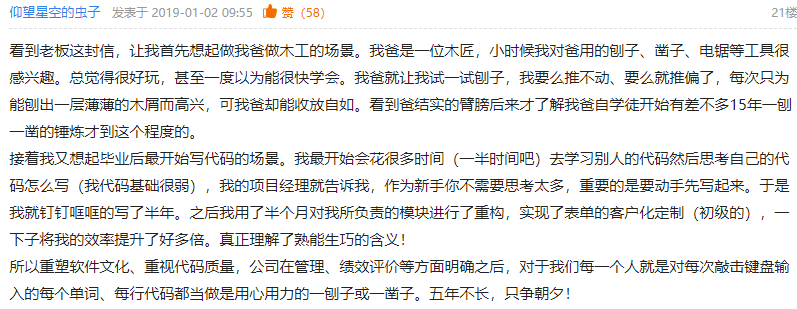

> 全文来自：心声社区 [全面提升软件工程能力与实践，打造可信的高质量产品](http://xinsheng.huawei.com/cn/index.php?app=forum&mod=Detail&act=index&id=4134815)
>
> 任正非 2018年12月27日

我今天写信，是要和大家沟通公司**如何全面提升软件工程能力和实践**。<u>二十年前的`IPD`变革，重构了我们的**研发模式**，实现了从依赖**个人、偶然性推出成功产品**，到**制度化、持续地推出高质量产品**的转变</u>。至今为止，我们的产品和解决方案已经在170多个国家**安全稳定**运行，并因此积累和赢得了全球数万客户的信任。今天，我们又处在一个新的起点，**全面云化、智能化、软件定义一切**等**发展趋势**，对`ICT`基础设施产品的**可信**提出了前所未有的要求。**可信将成为客户愿买、敢买和政府接受、信任华为的基本条件**。可信不仅仅是产品**外在表现**的高质量**结果**，更是产品**内在实现**的高质量**过程**，是**结果和过程的双重可验证的高质量**。而只有全面提升**软件工程能力和实践**，才有可能打造出可信的高质量产品。

> 什么是华为的 `IPD` 变革？这一变革和研发模式、推出产品的过程有什么联系？

公司已经明确，把**网络安全和隐私保护**作为公司的**最高纲领**。我们要在每一个`ICT`基础设施产品和解决方案中，都融入信任、构建高质量，关键内容包括：

1. **安全性（Security）**。产品有良好的**抗攻击能力**，保护业务和数据的**机密性、完整性和可用性**。

2. **韧性（Resilience）**。系统受攻击时保持有定义的运行状态，包括降级，以及遭遇攻击时快速恢复的能力。

3. **隐私性（Privacy）**。遵从隐私保护既是法律法规的要求，也是价值观的体现。用户应该能够适当地控制他们的数据的使用方式。信息的使用政策应该是对用户透明的。用户应该根据自己的需要来控制何时接收以及是否接收信息。用户的隐私数据要有完善的保护能力和机制。

4. **可靠性和可用性（Reliability& Availability）**。产品能在生命周期内长期保障业务无故障运行，具备**快速恢复**和**自我管理**的能力，提供**可预期的、一致的**服务。

全面提升软件工程能力和实践，关乎公司未来的生存和发展，与我们每一个人都息息相关。在此，我希望全体员工、**特别是软件工程师们**主动参与进来，从自己做起，踏踏实实，共同打造可信的高质量产品。

**我们要转变观念，追求打造可信的高质量产品，不仅仅是功能、特性的高质量，也包括产品开发到交付过程的高质量。**我们知道，功能、特性对产品至关重要，我们更知道，进度对满足客户需求也至关重要。今天，我们要把可信作为第一优先级，放在**功能、特性和进度**之上。除非客户信任我们的产品，否则这些优秀的特性都没有机会发挥价值。我们各级管理者和全体员工都不得以进度、功能、特性等为理由来降低可信的要求，确保可信的要求在执行过程中不变形。

**我们要从最基础的编码质量做起，视高质量代码为尊严和个人声誉。**代码就像是高楼大厦的一砖一瓦，没有高质量的代码，可信的产品就是空中楼阁。我们要优化并遵循公司各种**编程规范**，遵从**架构与设计原则**，熟练使用各种编程库和`API`，编写出**简洁、规范、可读性强、健壮安全**的代码。

**我们要深刻理解架构的核心要素，基于可信导向来进行架构与设计。**在确保可信的前提下，要在性能、功能、扩展性等方面做好权衡；慎重地定义我们的模块与接口，真正做到高内聚与低耦合；我们要遵循权限和攻击面最小化等安全设计原则，科学设计模块之间的隔离与接口，提升安全性；低阶架构与设计要遵循高阶的架构与设计原则，在充分理解原有架构与设计的情况下，持续优化；我们要熟悉各种设计模式，重用公共成熟组件和服务，避免重复劳动。

**我们要重构腐化的架构及不符合软件工程规范和质量要求的历史代码。**我们知道，再好的架构，其生命力也是有限的。随着时间的推移、环境的变化以及新技术、新功能特性的引入，架构也会腐化。面对腐化了的架构，要毫不犹豫地去重构它。同时主动以可信设计原则为导向，去重构不符合软件工程规范和质量要求的历史代码，提升软件架构的生命力。

**我们要深入钻研软件技术，尤其是安全技术。**软件技术是我们打造产品的基本工具，技术是否先进，技术选择是否合理，将决定我们软件的高度；我们要深入学习**架构与设计、编码、测试、安全、可用性、性能、维护性、体验**等技术，并科学运用这些技术。

**我们要遵守过程的一致性。**遵守适用的法律法规、遵循业界共识的标准、规范，确保规范到实现的一致性、代码到二进制的一致性。**架构要符合架构原则，设计要遵循设计模式，代码要符合编程规范**，最终做到需求与实现一致，达成各项对客户的承诺。我们只有脚踏实地做好每一步，才能真正打造出可信的高质量产品。

**为此，我们要改变行为习惯，追求精品。**我们要开放透明、积极和勇于揭示问题并主动推动改进。软件开发是一种创造性和艺术性的工作，需要充分发挥我们的聪明才智和潜力。我们要改变只重视功能结果、不重视代码质量的行为习惯，要严格遵守软件工程规范；改变被动的修修补补；改变碎片化知识获取，主动去学习提升并贡献经验、代码，形成**共享知识库**。我们需要改变的行为和习惯还有很多，对绝大多数人来讲都将是一个痛苦的转变过程，会脱一层皮，但我相信大家能够迎接这种挑战。

**更为重要的是，我们将通过变革形成一套适应上述变化的流程、组织与考核机制。**我们要完善并增强透明、可回溯和可审计的全流程管理机制，以可信的视角，从初始设计、完整构建到产品生命周期管理，全面提升软件工程能力和实践。我们将全面强化以`Committer`角色为核心的代码审核和提交机制，代码经过更加严格和系统的审核才能合入版本。为此我们将建立一支更高水平的`Committer`角色群体，负责软件架构的看护、代码的审核和提交，整体保障合入代码的高质量。我们要变革考核机制，要让架构设计好、代码写得好的人脱颖而出，对编程能力不满足要求的人给予帮助和培训。但任何人如果编写的代码长时间不能合入版本，将会被团队抛弃。

过去一百年来，世界上许多成功的公司都因不能适应变化而倒下。**要适应外部变化，唯有自我进化，我们必须保持开放和持续变革**。董事会已决定，全面提升软件工程能力与实践将以变革的方式来开展，由轮值董事长徐直军总负责，公司初始投入20亿美元，计划用5年时间，在`ICT`基础设施领域实现为客户打造可信的高质量产品的目标。希望您支持并积极投入到这一伟大的变革。唯有如此，我们才能实现未来的**愿景和使命**：**把数字世界带入每个人、每个家庭、每个组织，构建万物互联的智能世界**。

