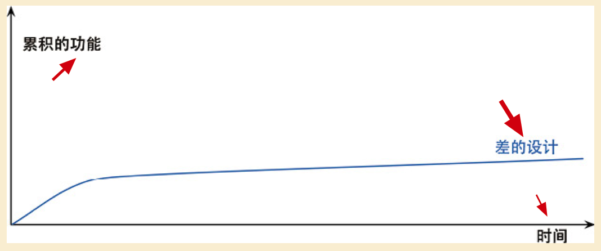
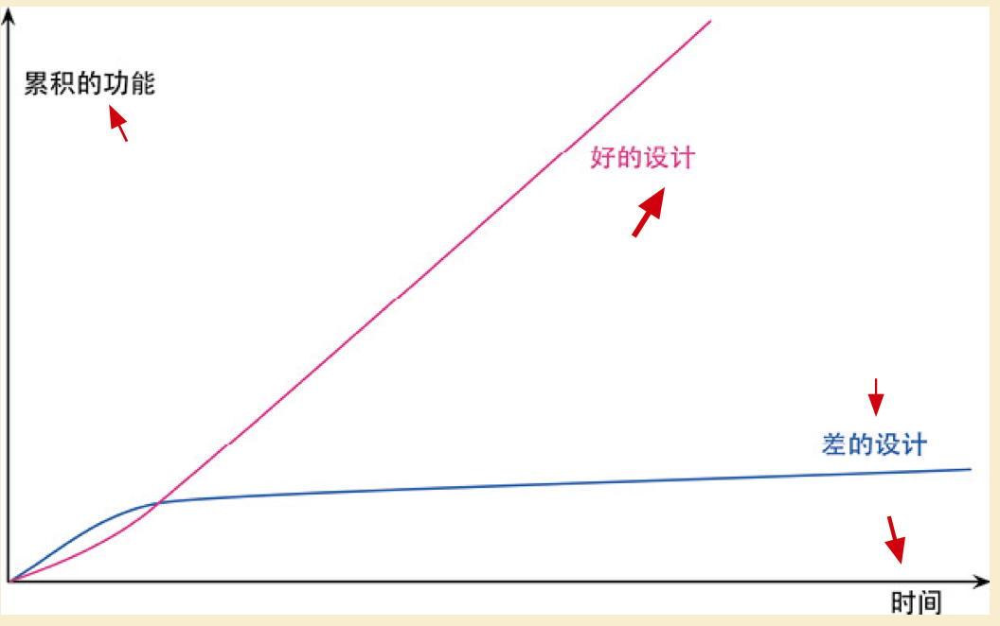

本书在讲什么？

本书揭示了**<u>重构过程</u>**，解释了**<u>重构的原理和最佳实践</u>**，并指出何时何地你应该开始挖掘你的代码以求改善。本书的核心是一系列完整的重构方法，其中每一项都介绍**<u>一种经过实践检验的代码变换手法的动机和技术</u>**。

本书的目的是告诉：**<u>如何以一种可控且高效的方式进行重构</u>**。可以学会如何有条不紊地改进程序结构，而且不会引入错误，这就是**<u>正确的重构方式</u>**。

==重构的意义不在于把代码库打磨得闪闪发光，而是纯粹经济角度出发的考量。我们之所以重构，因为它能让我们更快——添加功能更快，修复 bug 更快。==一定要随时记住这一点，与别人交流时也要不断强调这一点。==重构应该总是由经济利益驱动，意在提高生产力==。

**<u>重构有风险！</u>**它必须修改正在工作的程序，这可能引入一些不易察觉的错误。如果重构方式不恰当，可能毁掉你数天甚至数周的成果。**<u>如果重构时不做好准备，不遵守规则，风险就更大</u>**。

重构是软件开发过程的一块**<u>基石</u>**！

# 1 赞誉之词

「当今**<u>软件开发的速度越来越快，带来的技术债也越来越多</u>**，我从 CSDN 自身的网站系统开发中充分认识到重构的重要性——如果我们的程序员能够**<u>理解和掌握重构的原则和方法</u>**，我们的系统就不会有这么多沉重的债务。**<u>真正本质的东西是不变的</u>**，《重构》在出版 20 年后推出了第2版，再次证明：**<u>越本质的越长久，也越重要</u>**。衷心期待更多的新一代开发者能从这本书吸收营养，开发出**<u>好味道的系统</u>**。」——蒋涛，CSDN创始人/董事长

「“对于软件工程师来说，**<u>重构，并不是额外的工作，它就是编码本身</u>**。”直到我读过《重构》，并经过练习，才真正理解到这一点。真希望自己在20多年前写第一个软件时，就能读到这本书，从而能节省出**<u>大量调试或重复研究代码的时间</u>**......」——乔梁，腾讯高级管理顾问

「当我还是编程菜鸟，想写出漂亮的代码而不得门道的时候，《重构》这本书就告诉了我，其实**<u>高手的代码也不是一次书就的</u>**，只要按本书里的方法去做，谁都能把代码写得那么好；当我还是职场新人，没来得及写出太多垃圾代码的时候，这本书就教会了我，**<u>应该去追求编写人能够读懂的而不是仅机器能够读懂的代码</u>**。多年以后的某时某刻，当你编码自信而敏捷，因代码清晰而受人尊重时，你会庆幸读过这本书，你也会有些遗憾，应该再早一点去读这本书。**<u>无论过去了多少年，这本书，一直值得推荐</u>**。」——阎华，京东 7FRESH 架构师

「在大获成功的《重构》第一版里，Martin Fowler 传达的核心理念是：**<u>代码会随时间流逝而烂掉</u>**。写得再好的程序代码，若是发布了就一直保持原样，照样会风化、破碎乃至分崩离析。**<u>这是客观规律，避免这种命运的唯一出路是持续重构</u>**。要想成为高素质的软件工程师，必须认识这一点。**<u>软件不死，重构不歇</u>**。」——余晟，《代码整洁之道：程序员的职业素养》译者

「软件行业已经高速发展数十年，就好似一个崭新的城市，从一个个村屋矮房到高楼林立。而你的**<u>代码库</u>**就好比你手下的一个房间、一栋平房、一条街道、一片街道、一片社区乃至是一座摩天大楼。作为一本经典的软件开发书，**<u>《重构》告诉我们的不仅仅是如何推倒重建、清理、装修，而是像一个规划师一样从目的、成本、手段、价值等综合维度来思考重构的意义</u>**。」——阴明，掘金社区创始人

「框架设计者知道，这东西不可能一开始就完全正确，它将随着设计者的经验成长而进化；他们也知道，代码被阅读和被修改的次数远远多于它被编写的次数。<u>**保持代码易读、易修改的关键，就是重构**</u>——对框架而言如此，对一般软件也如此。」

识别坏味道、测试先行、行为保持的变更动作，是重构的基本功。

很多人会强调“只看结果”，轻视做事的过程与方式。然而对于**<u>软件开发的专业人士</u>**而言，如果忽视了**<u>过程与方式</u>**，也就等于放弃了我们自己的**<u>立身之本</u>**。

「Fowler 先生近二十载对这本书、对重构手法的精心打磨，给了我们一个榜样：一个对匠艺上心的专业人士，**<u>日积月累对过程与方式的重视</u>**，是能有所成就的。」

【**<u>时时勤拂拭，勿使惹尘埃。</u>**】

# 2 前言

对于是否重构项目，项目经理和软件工程师总是有不同的思考角度：

* 项目经理：「项目进度拍的很紧，有许多工作要做。系统必须在几个月之后发布，而这些程序员却拜拜耗费了两天时间，做的工作与未来几个月要交付的大量功能毫不相干。想要交付给客户的，是可以有效运行的代码，不是用以取悦学究的代码。所有这些工作只是为了让代码看起来更漂亮，并不能给系统添加任何新功能。」
* 程序员：新的设计更加“纯粹”、更加“整洁”。

项目失败后被重启时，顾问做了最重要的一件事情：**<u>坚持以持续不断的重构行为来整理代码</u>**。

那什么是重构？重构是这样的**<u>一个过程</u>**：在不改变代码**<u>外在行为</u>**的前提下，对代码作出修改，以改进程序的**<u>内部结构</u>**。重构是一种**<u>经千锤百炼形成的</u>**有条不紊的**<u>程序整理方法</u>**，可以最大限度地减小整理过程中引入错误的概率。**<u>本质上说，重构就是在代码写好之后改进它的设计</u>**。

在软件开发的大部分历史时期，**<u>大部分人相信应该先设计而后编码：首先得有一个良好的设计，然后才能开始编码</u>**。但是，随着时间流逝，人们不断修改代码，于是**<u>根据原先设计所得的系统，整体结构逐渐衰弱</u>**。代码质量慢慢沉沦，编码工作从**<u>严谨的工程</u>**堕落为**<u>胡侃乱劈的随性行为</u>**。

> 一直认为软件设计是在编码之前的，却是是这样。
>
> 但是，自己忽略了软件在不断演进过程中原先架构会变得“模糊”。而改变这种状况的方法就是：**<u>持续重构</u>**！

“重构”正好于此相反。哪怕手上有**<u>一个糟糕的设计</u>**，甚至是<u>**一堆混乱的代码**</u>，我们也可以借由重构将它加工成设计良好的代码。**<u>聚沙成塔，这些小小的修改累计起来就可以改善设计质量</u>**。这和一般常见的“软件会慢慢腐烂”的观点恰恰相反！

> 也就是：即便之前的设计是糟糕的，或者接受了一份混乱的代码（这在一些小型公司经常出现），都可以根据已经掌握的【重构】知识，将其加工、转化成设计良好的代码。

有了重构以后，工作的平衡点开始发生变化。**<u>设计不是在一开始完成的，而是在整个开发过程中逐渐浮现出来</u>**。在系统构筑过程中，需要**<u>不断改进设计</u>**。这个**<u>【“构筑-设计”的反复互动】</u>**中，可以让一个程序**<u>在开发过程中</u>**持续保持良好的设计。

与软件开发中的大多数技术性领域一样，**<u>代码范例对于概念的阐释至关重要</u>**。不过，**<u>即使在不同的编程语言中，重构手法看上去也是大同小异的</u>**。虽然会有一些值得留心的语言特性，**<u>但重构手法的核心要素都是一样的</u>**。（核心是相通的！也就是说重构的核心思想是和编程语言无关的。）

尽管本书的关注对象是代码，但重构对于**<u>系统设计</u>**也有巨大影响。

透彻理解本书需要回答如下问题：

1. 重构是什么？重构的过程是什么？
2. 为什么应该重构？
3. 在什么地方重构？具有何种特征的代码需要重构？
4. 怎么进行代码重构？

> 本书的阅读方法：解答上述前 3 个问题，然后有选择性地阅读重构名录。**<u>对于重构名录，不必理解所有细节</u>**。一旦真正需要实施某个重构手法，再详细阅读，并从中获得帮助（在工程实施中，查阅并获得最佳实践方法）。列表部分是供查阅的参考性内容，不必一次就把它全部读完。
>
> **<u>一旦真正需要实施某个重构手法，再详细阅读，并从中获得帮助（在工程实施中，查阅并获得最佳实践方法）</u>**。

# 3 重构示例

> 示例为什么如此重要？
>
> 谈原理，很容易流于泛泛，又很难说明如何实际应用。给出一个示例，就可以帮助我把事情认识清楚，让我看见事情在真正进行。

**<u>代码组织不甚清晰</u>**：虽然编译器不在乎代码好不好看，但是，当我们需要修改系统时，就涉及了人（比如接手了一个代码组织不甚清晰的项目），而人在乎这些。**<u>差劲的系统是很难修改的</u>**，因为很难找到修改点，难以了解作出的修改与现有代码如何**<u>协作</u>**实现我想要的行为。如果很难找到修改点，就很有可能犯错，从而引入 bug。

> 这就解释了代码组织不甚清晰时，程序员为什么很难做出修改。

（==程序的结构，具有良好的结构有益于理解代码在做什么==）如果我需要修改一个有几百行代码的程序，我会期望它有**<u>良好的结构</u>**，并且已经被分解成一系列函数和其他程序要素，这能帮我更易于清楚地了解这段代码在做什么。如果**<u>程序杂乱无章，先为它整理出结构来，再做需要的修改</u>**，通常来说更加简单。「如果你要给程序添加一个特性，但发现代码因缺乏良好的结构而不易于进行更改，那就先重构那个程序，**<u>使其比较容易添加该特性</u>**（其实就是在**<u>整理结构</u>**），然后再添加该特性。」

**<u>什么时候需要意识到重构？是需求的变化使重构变得必要</u>**（这种情况下，确实有人需要理解它的工作原理，并且觉得理解起来很费劲，那就需要改进一下代码了），如果一段代码能正常工作，并且不会再被修改，那么完全可以不去重构它。能改进之当然很好，但若没人需要去理解它，它就不会真正妨碍什么。随着各种规则变得越来越复杂，适当的修改点将越来越难找，不犯错的机会也越来越少。

（重构的第一步：借助现代的测试框架，实施测试集。重构前，先检查自己是否有一套可靠的测试集。这些测试必须有自我检验能力）每当我要进行重构时，第一个步骤永远相同：我得**<u>确保即将修改的代码拥有一组可靠的测试</u>**。这些测试必不可少，因为尽管遵循重构手法可以使我避免绝大多数引入 bug 的情形，但我毕竟是人，毕竟有可能犯错。==在数字时代，软件的名字就是脆弱！==测试过程中很重要的一部分，就是**<u>测试程序对于结果的报告方式</u>**。现代的测试框架都提供了丰富的设施，支持编写和运行能够自我检验的测试。

（进行重构时，依赖测试。构筑测试体系对重构来说是在太重要了）**<u>将测试视为 bug 检测器</u>**，能保护程序不被自己犯的错误所困扰。把我想要达成的目标写两遍——代码里写一遍，测试里再写一遍——我就得犯两遍同样的错误才能骗过检测器。

（代码写出来是供各个工程师交流使用的，是给人看的，需要尽量写得易于理解——**<u>提升代码的表达能力</u>**）自己脑海中==对代码的理解是转瞬即逝的灵光，我需要梳理这些灵感，将它们从脑海中搬回到代码里去，以免忘记==。这样当我回头看时，**<u>代码就能告诉我它在干什么</u>**，我不需要重新思考一遍。「傻瓜都能写出计算机可以理解的代码。**<u>唯有能写出人类容易理解的代码的，才是优秀的程序员</u>**。」

（遵循：**<u>修改、编译、测试、提交</u>**，在事情变得复杂时，采用更小的步子。细小的步子是快速前进的关键）无论每次重构多么简单，养成重构后即运行测试的习惯非常重要。**<u>重构的精髓：小步修改，每次修改后就运行测试</u>**。重构技术就是以微小的步伐修改程序。如果你犯下错误，很容易便可发现它（只需要考虑**<u>一个很小的改动范围</u>**，这使得差错与修复问题易如反掌）。

重构早起的一般步骤：把复杂的代码库分解为**<u>更小的单元</u>**（为原函数添加足够的**<u>结构</u>**，以便我梦更好地理解它），与好的命名一样都很重要。

**<u>移除局部变量</u>**的好处就是做提炼时会简单得多，因为需要操心的局部作用域变少了。实际上，在做任何提炼前，我一般都会先移除局部变量。这些局部（临时）变量往往会带来麻烦，它们只在对其进行处理的代码块中有用，因此临时变量实质上是鼓励你写长而复杂的函数。

**<u>好的命名十分重要</u>**，包括：函数、变量等。只有恰如其分地命名，才能彰显出将大函数分解成小函数的价值。**<u>有了好的名称，我就不必通过阅读函数体来了解其行为</u>**。但要一次就把名取好并不容易。通常你需要花几秒钟通读更多代码，才能发现最好的名称是什么。

（**<u>如果重构引入了性能损耗，先完成重构，再做性能优化</u>**）许多程序员对代码实际的运行路径都所知不足，甚至经验丰富的程序员有时也未能避免。在聪明的编译器、现代的缓存技术面前，我们很多直觉都是不准确的。软件的性能通常只与代码的一小部分相关，改变其他的部分往往对总体性能贡献甚微。**<u>通常情况下，先让代码有一个良好的结构，回头调优其性能也容易得多</u>**。最后得到的是既整洁又高效的代码。

上面所做的一切，都有一个共同的目标：为原函数添加足够的==结构==，以便能够更好的理解它，看清它的逻辑==结构==。**<u>把复杂的代码块分解为更小的单元，与好的命名一样都很重要</u>**。

虽然代码的行数增加了，但重构也带来了**<u>代码可读性</u>**的提高。额外的包装将混杂的逻辑分级成可辨别的部分，分离了计算逻辑与样式。这种**<u>模块化</u>**使我们更容易辨别代码的不同部分，了解它们的协作关系。虽说言以简为贵，但可演化的软件却以明确为贵。编程时，需要遵循**<u>营地法则</u>**：**<u>保证你离开时的代码库一定比来时更健康</u>**。

一般来说，重构早期的主要动力是**<u>尝试理解代码如何工作</u>**。通常你需要先通读代码，找到一些感觉，然后再通过重构将这些感觉从脑海里搬回到代码中。**<u>清晰的代码更容易理解</u>**，使你能够发现更深层次的设计问题，从而形成积极正向的反馈环。

但**<u>什么样的代码才算好代码</u>**——这不仅关乎**<u>个人品味</u>**，而且是有**<u>客观标准</u>**的。好代码的检验标准就是人们**<u>是否能轻而易举地修改它</u>**。好代码应该**<u>直截了当</u>**：有人需要修改代码时，他们应能轻易找到修改点，应该能快速做出更改，而不易引入其他错误。**<u>一个健康的代码库能够最大限度地提升我们的生产力，支持我们更快、更低成本地为用户添加新特性</u>**。为了保持代码库的健康，就需要时刻留意现状与理想之间的差距，然后通过重构不断接近这个理想。「我偏爱**<u>小的、命名良好的函数</u>**！每当看到<u>长长的函数</u>，我便下意识地想从整个函数中分离出**<u>不同的关注点</u>**。」

开展高效有序的重构，关键的心得是：==小的步子可以更快前进，请保持代码永远处于可工作状态，小步修改累计起来也能大大改善系统的设计==。

# 4 重构的原则

本节主要讲述在重构中的一些**<u>大原则</u>**！

重构这个词既可以用作名词也可以用作动词：

* 名词：对软件内部结构的**<u>一种调整</u>**，目的是在不改变软件**<u>可观察行为</u>**的前提下，提高其可理解性，降低其修改成本。
* 动词（Restructuring）：使用一系列重构方法，在不改变软件可观察行为的前提下，**<u>调整其结构</u>**。

重构的关键在于**<u>运用大量微小且保持软件行为的步骤，一步步达成大规模的修改</u>**。每个单独的重构要么很小，要么由若干小步骤组合而成。因此，在重构的过程中，必须保证代码很少进入不可工作的状态，即便重构没有完成，也可以在任何时刻停下来。如果有人说他们的代码在重构过程中有一两天时间不可用，基本上可以确定，他们在做的事不是重构。

很多小步骤完成可以一大步就能做完的事，可能会觉得这样很低效。但小步前进能让我**<u>走得更快</u>**。因为这些小步骤能完美地彼此组合，而且——更关键的是——整个过程中我**<u>不会花任何时间来调试</u>**。

重构与性能优化有很多相似之处：两者都需要修改代码，并且两者都不会改变程序的**<u>整体功能</u>**。两者的差别在于其目的：**<u>重构是为了让代码“更容易理解，更易于修改”</u>**。这可能使程序运行得更快，也可能使程序运行得更慢。在性能优化时，我只关心让程序运行得更快，最终得到的代码有可能更难理解和维护，对此必须有心理准备。

Kent Beck 提出了**<u>“两顶帽子”的比喻</u>**。在使用重构技术开发软件时，把自己的时间分配给两种截然不同的行为：**<u>添加新功能</u>**和**<u>重构</u>**。添加新功能时，不应该修改既有代码，只管添加新功能。通过添加测试并让测试正常运行。重构时就不能再添加功能，只管调整代码的结构。

重构是一个工具，可以帮我们始终**<u>良好地控制自己的代码</u>**。可以用于以下几个**<u>目的</u>**：

1. ==重构改进软件的设计==。如果没有重构，程序的内部设计（或者叫架构）会逐渐腐败变质。当人们**<u>只为短期目的而修改代码</u>**时，他们经常**<u>没有完全理解架构的整体设计</u>**，于是代码逐渐失去了自己的结构。程序员通过阅读源码越来越难以理解原来的设计。**<u>代码结构的流失有累积效应</u>**。越难看出代码所代表的设计意图，就越难保护其设计，于是设计就腐败得越快。经常性的重构有助于代码维持自己该有的形态。完成同样一件事，设计欠佳的程序往往需要更多代码，这常常是因为代码在不同的地方使用完全相同的语句做同样的事，因此**<u>改进设计的一个重要方向就是消除重复代码</u>**。代码越多，做正确的修改就越困难，因为有更多代码需要理解。

   **<u>消除重复代码，就可以确定所有事物和行为在代码中只表述一次，这正是优秀设计的根本</u>**。

2. ==重构使软件更容易理解==。所谓程序设计，很大程度上就是**<u>与计算机对话</u>**——我编写代码告诉计算机做什么事，而它的响应是按照我的指示精确行动。也就是填补“我想要它做什么”和“我告诉它做什么”之间的缝隙。编程的核心就在于“准确说出我想要的”。另外一个层次是面向程序员的，也就是考虑几个月之后可能会有**<u>另外一位程序员尝试读懂代码并对其做一些修改</u>**。在重构上花一点点时间，就可以**<u>让代码更好地表达自己的意图</u>**——更清晰地说出我想要做的。

   「事实上，对于任何能够立刻查阅的东西，我都故意不去记它，因为我怕把自己的脑袋塞爆。我总是尽量把该记住的东西写进代码里，这样我就不必记住它了。」

3. ==重构帮助找到 bug==。如果对代码进行重构，就可以深入理解代码的所作所为，并立即把新的理解反映在代码当中。搞清楚程序结构的同时，也验证了自己所做的一些假设，从而揪出了 bug。重构能够帮助我们更有效地写出**<u>健壮的代码</u>**。

4. **<u>重构提高编程速度</u>**。

   

   差的软件设计，其代码库看起来就像补丁摞补丁，需要细致的考古工作才能弄明白整个系统是如何工作的。这份负担不断拖慢新增功能的速度，到最后程序员恨不得从头开始重写整个系统。

   

   两种团队的区别在于**<u>软件的内部质量</u>**。需要添加新功时，**<u>内部质量良好的软件让我可以很容易找到在哪里修改、如何修改</u>**。良好的模块划分使我只需要理解代码库的一小部分，就可以做出修改。如果代码很清晰，我引入 bug 的可能性就会变小，即使引入 bug，调试也会容易得多。理想情况下，我的**<u>代码库会逐步演化成一个平台</u>**，在其上可以很容易地构造与其领域相关的新功能。

通过投入精力改善内部设计，我们增加了==软件的耐久性==，从而可以更长时间地保持开发的快速。

20年前，==行业的陈规==认为：良好的设计必须在开始编程之前完成，因为一旦开始编写代码，设计就只会逐渐腐败。重构改变了这个图景。现在我们可以改善已有代码的设计，因此我们可以先做一个设计，然后不断改善它，哪怕程序本身的功能也在不断发生着变化。由于==预先做出良好的设计非常困难==，**<u>想要既体面又快速地开发功能，重构必不可少</u>**。

**<u>何时进行重构？</u>**——**<u>三次法则</u>**，第一次做某件事时只管去做；第二次做类似的事会产生反感，但无论如何还是可以去做；第三次再做类似的事，你就应该重构。==「事不过三，三则重构。」==

* **<u>预备性重构</u>**：重构的最佳时机就**<u>在添加新功能之前</u>**。「这就好像我要往东去100公里。我不会往东一头把车开进树林，而是先往北开20公里上高速，然后再向东开100公里。后者的速度比前者要快上3倍。如果有人催着你“赶快直接去那儿”，有时你需要说：“等等，我要先看看地图，找出最快的路径。”这就是预备性重构于我的意义。」
* **<u>帮助理解</u>**的重构：我需要**<u>先理解代码在做什么，然后才能着手修改</u>**。一旦我需要思考“这段代码到底在做什么”，我就会自问：”**<u>能不能重构这段代码，令其一目了然？</u>**“这些都是重构的机会。如果==把对代码的理解植入代码中==，这份知识会保存得更久。当代码变得更清晰一些时，就会看见之前看不见的设计问题。如果不做前面的重构，可能永远都看不见这些设计问题。**<u>「这些初步的重构就像扫去窗上的尘埃，使我们得以看到窗外的风景。」</u>**在研读代码时，重构会引领我获得更高层面的理解，如果只是阅读代码很难有此领悟。有些人以为这些重构只是毫无意义地把玩代码，他们没有意识到，缺少了这些**<u>细微的整理</u>**，他们就无法看到隐藏在一片混乱背后的**<u>机遇</u>**。
* **<u>捡垃圾</u>**式重构：这种是帮助理解的重构的一种变体——已经理解代码在做什么，但发现它做得不好。有的垃圾可能立马就可以重构，也可能需要花一些精力。不过即便如此，稍微花一点功夫做一点儿清理，通常都是值得的。**<u>重构的妙处就在于，每个小步骤都不会破坏代码</u>**。
* **<u>有计划</u>**的重构：一般情况下，并不专门安排一段时间来重构，而是在添加共功能或修复 bug 的同时顺便重构。这是**<u>自然的编程流</u>**的一部分。不管是要添加功能还是修复 bug，重构对当下的任务有帮助，而且让未来的工作更轻松。**<u>肮脏的代码必须重构，但漂亮的代码也需要很多重构</u>**。每次要修改时，首先令修改很容易（即重构），然后再进行这次容易的修改。优秀的程序员知道，添加新功能最快的方法往往是先修改现有的代码，使新功能容易被加入。所以，==软件永远不应该被视为“完成”==。每当需要新能力时，软件就应该做出相应的改变。
* **<u>长期重构</u>**：比如要替换一个正在使用的库，或者将整块代码抽取到一个组件中并共享给另一支团队使用，再或者要处理一大堆混乱的依赖关系，等等。即便是这种情况，也无需让一支团队专门做重构。可以让整个团队达成共识，在未来几周时间里**<u>逐步解决这个问题</u>**——每当有人靠近“重构区”的代码，就把它朝想要改进的方向推动一点。这个策略的好处在于，重构不会破坏代码——**<u>每次小改动之后，整个系统仍然照常工作</u>**。
* **<u>复审代码时重构</u>**：Code Review 的重构，这种活动可以改善开发状况。代码审查有助于在开发团队中传播知识，也有助于让较有经验的开发者把知识传递给比较欠缺经验的人，并帮助更多人理解大型软件系统中的更多部分。代码复审对于**<u>编写清晰代码</u>**也很重要。**<u>我的代码也许对我自己来说很清晰，对他人则不然</u>**。这是无法避免的，因为要让开发者设身处地为那些不熟悉自己所作所为的人着想，实在太困难了。代码复审也让更多人有机会提出有用的建议。结对编程的形式是最有效率的方式，因为作者能提供关于**<u>代码的上下文信息（类似 Android 中的 Context 对象）</u>**，并且充分认同复审者进行修改的意图。

==软件开发者都专业人士==。我们的工作就是静可能快速创造出高效软件。我的经验告诉我，对于快速创造软件，重构可带来巨大帮助。

1. 如果需要**<u>添加功能</u>**，而原先设计却又使我无法方便地修改，先重构再添加新功功能会更快些。
2. 如果要**<u>修补错误</u>**，就得先理解软件的工作方式，而重构是理解软件的最快方式。

『受进度驱动的经理要我尽可能快速完成任务，至于怎么完成，那就是我的事了。**<u>我领这份工资，是因为我擅长快速实现新功能</u>**；我认为最快的方式就是重构，所以我就重构！』

==何时不应该重构？==如果我看见一块凌乱的代码，但并不需要修改它，那么我就不需要重构它。如果丑陋的代码能被隐藏在一个 API 之下，我就可以容忍它继续保持丑陋。只有当我**<u>需要理解其工作原理</u>**时，对其进行重构才有价值。如果**<u>重写</u>**比重构还容易，就别重构了。决定到底应该重构还是重写，需要良好的判断力与丰富的经验。==并非所有的代码都需要重构！==

（重构遇到的==挑战==）==重构的唯一目的就是让我们开发更快，用更少的工作量创造更大的价值==。有一种情况确实需要权衡取舍——有时会看到一个（大规模的）重构很有必要进行，而马上要添加的功能非常小，这时更应该先把功能加上，然后再做这次大规模重构。做这个决定需要判断力——这是作为程序员的专业能力之一。绝大多数人应该尝试多做重构。**<u>代码库的健康</u>**与否，到底会**<u>对生产率造成多大的影响</u>**，很多人可能说不出来，因为他们没有太多再健康的代码库上工作的经历——==轻松地把现有代码组合配置，快速构造出复杂的新功能==，这种强大的开发方式他们没有体验过。

（**<u>代码所有权</u>**）很多重构手法不仅会影响一个模块内部，还会影响该模块与系统其他部分的关系。代码所有权的边界会妨碍重构，因为一旦我自作主张地修改，就一定会破坏使用者的程序。重构中的代码所有权问题由此产生，推荐**<u>团队代码所有制解决方案</u>**——一支团队里的成员都可以修改这个团队拥有的代码，即便最初写代码的是别人。程序员可能各自分工负责系统的不同区域，但这种责任应该体现为**<u>监控自己责任区内发生的修改</u>**，而不是简单粗暴地禁止别人修改。比如：只要客户端接受（代码得到了**<u>审核</u>**）了他们的修改，就可以删除旧的函数声明了。

（**<u>开发分支</u>**管理）很多团队采用这样的版本控制实践：每个团队成员各自在代码库的一条分支上工作，进行相当大量的开发之后，才把各自的修改合并回主线分支（master或trunk），从而与整个团队分享。即：**<u>在分支上开发完整的功能，直到功能可以发布到生产环境，才把该分支合并回主线</u>**。这样的特性分支有其缺点：在隔离的分支上工作得越久，将完成的工作==集成==（integrate）回主线就会越困难。**<u>分支合并本来就是一个复杂的问题，随着特性分支存在的时间加长，合并的难度会指数上升</u>**。（如果特性分支存在的时间足够短，它们就不会造成大问题）CI 技术（Continuous Integration）也叫**<u>持续集成</u>**，就是规范每个团队成员每天至少向主线集成一次。这个实践避免了任何分支彼此差异太大，从而极大地降低了合并的难度。但你必须使用相关的实践以确保主线随时处于健康状态，必须学会将大功能拆分成小块，还必须使用特性开关将尚未完成又无法拆小的功能隐藏掉。**<u>持续集成技术的使用，降低了分支合并的难度</u>**。

> **<u>合并</u>**与**<u>集成</u>**的区别：
>
> * 合并：如果从主线合并到工作分支，这只是一个单向的代码移动。工作分支发生了修改，但主线并没有。
> * 集成：不仅要把主线的修改 pull 到工作分支上，而且要把工作分支的修改结果 push 回主线上。两边都会发生修改。

（**<u>测试</u>**）不会改变程序可观察的行为，这是重构的一个重要特征。==人总会有出错的时候==，不过只要**<u>及时发现</u>**，就不会造成大问题。既然每个重构都是很小的修改，即便真的造成了破坏，也只需要检查最后一步的小修改——就算找不到出错的原因，只要回滚到版本控制中最后一个可用的版本就行了。==这里的关键就在于“快速发现错误”。==要做到这一点，我的代码应该有**<u>一套完备的测试套件</u>**，并且运行速度要快，否则会不愿意频繁运行它。也就是说，绝大多数情况下，如果想要重构，我得先有可以**<u>自测试的代码</u>**。的确，团队必须投入时间与精力在测试上，但收益是绝对划算的。自测试的代码不仅使重构成为可能，而且使添加新功更加安全，因为可以很快并干掉新近引入的 bug。

> 疑问：什么是自测试代码？

（遗留代码）大多数人觉得，有一大笔遗产是件好事，但从程序员的角度来看就不同了。遗留代码往往很复杂，**<u>测试又不足</u>**，而且最关键的是，是别人写的。**<u>重构可以很好地帮助我们理解遗留系统</u>**。如果你面对一个庞大而又缺乏测试的遗留系统，很难安全地重构清理它。==一般来说，只有在设计系统时就考虑到了测试，这样的系统才容易添加测试==！强烈倡导从一开始就写能自测试的代码。如果是一个大系统，越是频繁使用的代码，**<u>改善其可理解性</u>**的努力就能得到越丰厚的回报。

（重构、架构和演进式开发）重构极大地**<u>改变</u>**了人们考虑软件架构的方式。有了重构技术，即便是已经在生产环境中运行了多年的软件，我们也有能力大幅度修改其架构——重构可以改善既有代码的设计。重构对架构最大的影响在于，==通过重构，我们能得到一个设计良好的代码库，使其能够优雅地应对不断变化的需求==。“在编码之前先完成架构”这种做法最大的问题在于，它假设了软件的需求可以预先充分理解。当经验显示，这个假设很多时候甚至可以说**<u>大多数时候是不切实际的</u>**。只有真正使用了软件、看到了软件对工作的影响，人们才会想明白自己到底需要什么。应对未来变化的办法之一，就是在软件里植入**<u>灵活性机制</u>**。在编写一个函数时，我会考虑它**<u>是否有更通用的用途</u>**。与其猜测未来需要哪些灵活性、需要什么机制来提供灵活性，我更愿意**<u>只根据当前的需求来构造软件</u>**，同时**<u>把软件的设计质量做得很高</u>**。随着对用户需求的理解加深，我会对架构进行重构，使其能够应对新的需要。**<u>只有当未来重构会很困难时，我才考虑现在就添加灵活性机制</u>**。这种设计方法有很多名字：简单设计、**<u>增量式设计</u>**或者 YAGNI（you aren't going to need it）的缩写。**<u>增量式设计是将架构、设计与开发过程融合的一种工作方式，但必须有重构作为基础才可靠</u>**。

（重构与软件开发过程）==重构的第一块基石是自测试代码==。应该有**<u>一套自动化的测试</u>**，可以频繁地运行它们，并且有==信心==：如果我在编程过程中犯了任何错误，会有测试失败。如果一支团队想要重构，那么每个团队成员都需要**<u>掌握重构技能</u>**，能在需要时开展重构，而不会干扰其他人的工作——**<u>持续集成技术让快速知晓变化成为了可能</u>**——有了 CI，每个成员的重构都能呢快速分享给其他同事，不会发生这边在调用一个接口那边却已把这个接口删掉的情况。自测试的代码也是持续集成的关键环节——**<u>自测试代码、持续集成、重构</u>**——彼此之间有着很强的协同效应。那我们需要构建的是这样的系统：一个简单的系统，而不是一个塞满了想当然的灵活性的系统，这样的代码既牢固可靠又能快速响应变化的需求。**<u>持续交付</u>**确保软件始终处于可发布的状态。有了**<u>可靠的技术根基</u>**，我们能够**<u>极大地压缩“从好点子到生产代码”的周期时间</u>**，从而更好地服务客户。这些技术实践也会增加软件的可靠性，减少耗费在 bug 上的时间。『这一切说起来似乎很简单，但实际做起来毫不容易。不管采用什么方法，**<u>软件开发都是一件复杂而微妙的事</u>**，涉及==人与人之间、人与机器之间的复杂交互==。不过，这些涉及到的实践方法对使用者的实践和技能有要求。』

（**<u>重构与性能</u>**）虽然重构可能使软件运行速度更慢，但它也**<u>使软件的性能优化更容易</u>**。除了对性能有严格要求的实时系统，其他任何情况下“编写快速软件”的秘密就是：**<u>先写出可调优的软件，然后调优它以求获得足够的速度</u>**。以下是 3 种编写快速软件的方法：

1. **<u>时间预算法</u>**，通常只用于性能要求极高的实时系统。比如心率调节器一类的系统，因为这样的系统中迟来的数据就是错误数据。
2. **<u>持续关注法</u>**，要求任何程序员在任何时间做任何事时，都要设法保持系统的高性能。这种方式很常见，感觉上很有吸引力，但通常不会起太大作用。任何修改如果是为了提高性能，通常会使程序难以维护，继而减缓开发速度。<u>**哪怕你完全了解系统，也请实际度量它的性能，不要臆测。臆测会让你学到一些东西，但十有八九你是错的**</u>。如果你对大多数程序进行分析，就会发现它把大半时间都耗费在一小半代码身上。如果你一视同仁地优化所有代码，90%的优化工作都是白费劲的，因为被你优化的代码大多很少被执行。
3. 利用上述的 90% 统计数据。采用这种方法时，编写构造良好的程序，不对性能投以特别的关注，直至进入性能优化阶段。在性能优化阶段，应该用一个度量工具来监控程序的运行，让它告诉我们程序中哪些地方大量消耗时间和空间。即：**<u>“发现热点，去除热点”的过程，直到获得客户满意的性能为止</u>**。

一个构造良好的程序可从两方面帮助这一优化方式：

* 有充裕的时间进行性能调整，因为有构造良好的代码在手，程序员能够更快速地添加功能，也就**<u>有更多时间用在性能问题上</u>**。
* 面对构造良好的程序，在进行性能分析时便有较细的粒度。度量工具会把程序员带入范围较小的代码段中，而性能的调整也比较容易些。由于代码更加清晰，因此我能够更好地理解自己的选择，更清楚哪种调整起关键作用。

总而言之，**<u>重构可以帮助我们写出更快的软件</u>**。

（重构的起源）==『优秀程序员肯定至少会花一些时间来清理自己的代码。这么做是因为，他们知道整洁的代码比杂乱无章的代码更容易修改，而且他们知道自己几乎无法一开始就写出整洁的代码。』==

